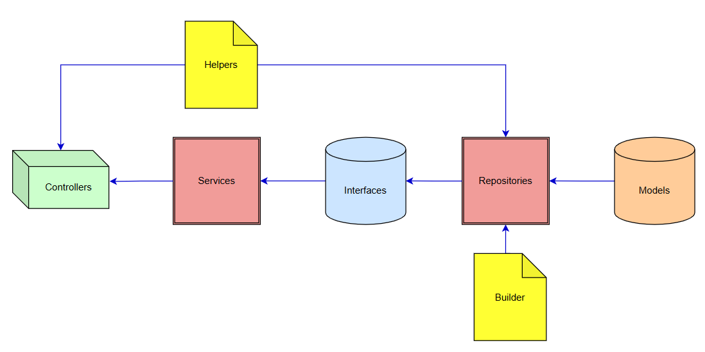

# Framework bachend API

Đây là bộ API thực hiện tách biệt với lớp giao diện, xử lý các nghiệp vụ trên server. API này sẽ chạy độc lập với UI.

## Table of Contents

- [Repository Pattern](#repository-pattern)
- [Workflow](#workflow)
- [Languages and Tools](#languages-and-tools)
    - [Backend](#backend)
    - [Database](#database)
    - [Tools](#tools)
- [Folder structure](#folder-structure)
- [Authors](#authors)
- [License](#license)

## Repository Pattern

<div style="text-align: center;">
 
</div>

## Workflow

- Client gọi vào API và được chuyển thẳng đến Controler
- Controller tiếp nhận thông tin (sử dụng mẫu Requests), sử dụng Helpers (nếu có) và chuyển gọi Services để thực thi
- Services  kết hợp dữ liệu từ nhiều Repository (gọi đến Interfaces) hoặc xử lý các logic phức tạp, đóng vai trò là "bộ điều phối" cho các tác vụ liên quan đến nghiệp vụ
- Repository implement Interfaces và thực hiện các thao tác truy vấn dữ liệu và gọi đến Models, Builder, Helpers (nếu có)

## Language and Tool<a id="language-and-tools"></a>

### Backend

- PHP 8.2
- Laravel 10 API
- Laravel Sanctum (Authentication)

### Database

- MySQL

### Tools

- Git
- GitHub
- NPM
- Composer

<a href="#table-of-contents" title="Go back to the table of contents">⬆️</a>
## Installation

### Requirements

- PHP 8.2
- Composer
- Node.js
- NPM

### Installation Steps

1. Clone the repository

   ```bash
   git clone https://github.com/dungnt3/framework.git
   ```

2. Install the dependencies

   ```bash
   cd path/to/backend && composer install
   ```

3. Create a copy of your .env file

   ```bash
   cd path/to/backend && cp .env.example .env
   ```

4. In the .env file in the backend, add database information to allow Laravel to connect to the database

   ```env
   DB_CONNECTION=mysql
   DB_HOST=
   DB_PORT=
   DB_DATABASE=
   DB_USERNAME=
   DB_PASSWORD=
   ```

5. Generate an app encryption key

   ```bash
   cd path/to/backend && php artisan key:generate
   ```

6. Migrate and seed the database

   ```bash
   cd path/to/backend && php artisan migrate --seed
   ```

7. Launch the backend

   ```bash
   cd path/to/backend && php artisan serve --port=8080
   ```
8. Visit the application

    ```bash
    http://localhost:8080
    ```

9. Link the storage folder in the backend

    ```bash
    cd path/to/backend && php artisan storage:link
    ```

<a href="#table-of-contents" title="Go back to the table of contents">
⬆️
</a>

## Folder structure<a id="folder-structure"></a>


| Folder/File            | Mô tả                                                                                                                                                                                                                                                                                                                                                                               |   
|:-----------------------|:------------------------------------------------------------------------------------------------------------------------------------------------------------------------------------------------------------------------------------------------------------------------------------------------------------------------------------------------------------------------------------| 
| `app`                  | `Thư mục app, chứa tất cả các project được tạo, hầu hết các class trong project được tạo đều ở trong đây Không giống các  framwork khác, các file model không được chứa trong một thư mục riêng biệt, mà được chứa ngay tại thư mục app này.`                                                                                                                                       | 
| `app/Builder`          | `Thực mục chứa các truy vấn`                                                                                                                                                                                                                                                                                                                                                        |
| `app/Console`          | `Thư mục Console, chứa các tập tin định nghĩa các câu lệnh trên artisan.`                                                                                                                                                                                                                                                                                                           |  
| `app/Exceptions`       | `Thư mục Exceptions, chứa các tập tin quản lý, điều hướng lỗi.`                                                                                                                                                                                                                                                                                                                     |  
| `app/Helpers`          | `Thực mục chứa các tiện ích`                                                                                                                                                                                                                                                                                                                                                        |
| `app/Http`             | `Thư mục chứa lớp Controllers, Middleware, mẫu Requests.`                                                                                                                                                                                                                                                                                                                           |  
| `app/Http/Controllers` | `Thư mục Controllers, chứa các controller của project.`                                                                                                                                                                                                                                                                                                                             |  
| `app/Http/Middleware`  | `Thư mục Middleware, chứa các tập tin lọc và ngăn chặn các requests.`                                                                                                                                                                                                                                                                                                               |  
| `app/Http/Requests`    | `Thư mục chứa các mẫu request từ client.`                                                                                                                                                                                                                                                                                                                                           | 
| `app/Models`           | `Thư mục chứa các Models`                                                                                                                                                                                                                                                                                                                                                           | 
| `app/Providers`        | `Thư mục Providers, chứa các file thực hiện việc khai báo service và bind vào trong Service Container.`                                                                                                                                                                                                                                                                             |  
| `bootstrap`            | `Thư mục bootstrap, chứa những file khởi động của  framework và những file cấu hình auto loading, route, và file cache.`                                                                                                                                                                                                                                                            |  
| `config`               | `Thư mục config, chứa tất cả những file cấu hình.`                                                                                                                                                                                                                                                                                                                                  |  
| `database`             | `Thư mục database, chứa 2 thư mục migration (tạo và thao tác database) và seeds (tạo dữ liệu mẫu), tiện lợi để lưu trữ dữ liệu sau này.`                                                                                                                                                                                                                                            |  
| `database/factories`   | `Thư mục factories, chứa các file định nghĩa các cột bảng dữ liệu để tạo ra các dữ liệu mẫu.`                                                                                                                                                                                                                                                                                       |  
| `database/migrations`  | `Thư mục migrations, chứa các file tạo và chỉnh sửa dữ liệu.`                                                                                                                                                                                                                                                                                                                       |  
| `database/seeds`       | `Thư mục seeds, chứa các file tạo dữ liệu thêm vào CSDL.`                                                                                                                                                                                                                                                                                                                           |  
| `public`               | `Thư mục public, chứa file index.php giống như cổng cho tất cả các request vào project, bên trong thư mục còn chứa file JavaScript, và CSS.`                                                                                                                                                                                                                                        |  
| `routes`               | `Thư mục routes, chứa tất cả các điều khiển route (đường dẫn) trong project. Chứa các file route sẵn có: web.php, channels.php, api.php, và console.php.`                                                                                                                                                                                                                           |  
| `routes/api.php`       | `Thư mục views, chứa các file view xuất giao diện người dùng.`                                                                                                                                                                                                                                                                                                                      |  
| `routes/web.php`       | `file web.php, điều khiển các route của view, như route của trang top, sản phẩm, ...`                                                                                                                                                                                                                                                                                               |  
| `storage`              | `Thư mục storage, chứa các file biên soạn blade templates của bạn, file based sessions, file caches, và những file sinh ra từ project. Thư mục app, dùng để chứa những file sinh ra từ project. Thư mục framework, chứa những file sinh ra từ framework và caches. Thư mục logs, chứa những file logs. Thư mục /storage/app/public, lưu những file người dùng tạo ra như hình ảnh.` |  
| `tests`                | `Thư mục tests, chứa những file tests, như PHPUnit test.`                                                                                                                                                                                                                                                                                                                           |  
| `vendor`               | `Thư mục vendor, chứa các thư viện của Composer.`                                                                                                                                                                                                                                                                                                                                   |  
| `.env`                 | `file .env, chứa các config chính của Laravel.`                                                                                                                                                                                                                                                                                                                                     |  
| `artisan`              | `file thực hiện lệnh của Laravel.`                                                                                                                                                                                                                                                                                                                                                  |  
| `.gitattributes`       | `File dành cho xử lý git.`                                                                                                                                                                                                                                                                                                                                                          |
| `.gitignore`           | `File dành cho xử lý git.`                                                                                                                                                                                                                                                                                                                                                          |
| `composer.json`        | `File của Composer.`                                                                                                                                                                                                                                                                                                                                                                |
| `composer.lock`        | `File của Composer.`                                                                                                                                                                                                                                                                                                                                                                |
| `package.json`         | `File của Composer.`                                                                                                                                                                                                                                                                                                                                                                |  
| `phpunit.xml`          | `file phpunit.xml, xml của phpunit dùng để testing project.`                                                                                                                                                                                                                                                                                                                        |  


## Authors

- [Nguyễn Tiến Dũng] - dungnt3@s-connect.net


## License

[S-Connect](https://sconnect.com.vn/)
